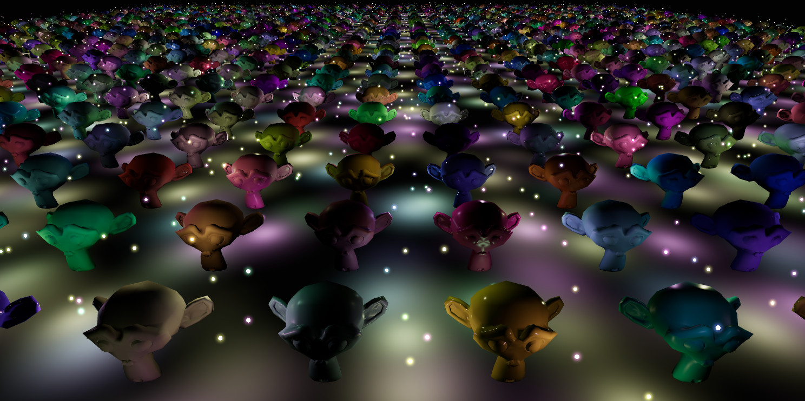

# Compute-Less Clustered Lighting

A technique for handling thousands of lights in WebGL by slicing the camera frustum into clusters and assigning lights to them. 

## Technique

The assignment of the lights into clusters is performed using the rasterization pipeline. We will use two textures to store the cluster lists.

##### List texture 

The list texture is of __RGBA unsigned byte__ type/format. We partition it spatially into XY tiles. Each 2D tile is then subdivided horizontally into Z depth slices / clusters. The above define a block of clusters where each texel contains a batch of 32 lights that belong in each cluster. 

We replicate the above structure vertically to create a vertical list of __(lightCount / 32)__ blocks. The total texture dimensions will be __width = X tiles * Z slices__ and height = Y tiles * N batches/blocks.

We clear all 4 channels to zero and proceed to rasterize all our lights in the list texture with an instanced draw call. Each light is represented as an instance of a quad. 

In the vertex shader we calculate the clip space bounds for each light sphere and apply it to the vertices of a quad. We snap the X clip coordinate to the Z cluster subdivisions to enclose whole tiles. We also scale and translate the Y coordinate to apply the quad on the appropriate batch/block with index __( lightInstanceID / 32 )__. Finally we calculate the min and max z depth slices that this light extends to and pass them as varyings to the fragment shader.

In the fragment shader, we find the depth slice of the current pixel as __( fragCoord.x \% numberOfdepthSlices)__ and if it is outside the min and max range in the varyings we calculated before, we discard it. Otherwise we proceed to set the appropriate bit in the cluster bitmask.

As WebGL doesn't support logical operations to OR the bits directly, we emulate them on top of fixed point by setting the Blend to __( ONE, ONE )__. Each RGBA texel is treated as a sequence of 4 bitmasks of 8 elements each for a total of 32 elements per batch. 

Based on the position of the light in  the batch __( positionInBatch = instanceID \% 32 )__ we raise two to the power 0 - 7 indicated by the position in the channel octet __( positionInBatch \% 8 )__ and divide by 255.

We write the result to the rgba channel(0-3) at __( positionInBatch / 8 )__ with the rest of the channels set to zero. The additive blending will then set the bit corresponding to the position of the light in this batch.

##### Master texture

The master texture is single channel __R32UI__. We use integers as 32 element bitmasks directly here since we don't need blending. The structure for this texture is similar to the list texture. 

We divide spatially into XY tiles and subdivide them horizontally into Z clusters but here we also subdivide the XY tiles vertically as well to add multiple master texels per cluster. 

Every master texel is a bitmask of 32 elements each of which indicates if a batch of 32 lights had at least one light active in this cluster. 

Unlike the list texture, we don't partition this texture into vertical blocks. The reason we arrange it like this, with the master masks contained in the XY tile, is to take advantage of caching later when we perform the lighting. 

We draw a fullscreen triangle and for each texel of the master texture, we fetch 32 texels for the corresponding XYZ clusters from each of 32 vertical blocks of the list texture and check if any of the rgba channels of the list texels is non zero. If true, we set the bit for this batch in the master texel. Eventually we end up with an hierarchy of bitmasks contained in the two textures.

##### Shading

When we apply the lighting, we figure out the XYZ cluster the current fragment belongs to and fetch the corresponding master texel(s). We iterate their bits and for those which are set, we fetch the corresponding texels from the list texture. We multiply each rgba channel by 255 and convert back to uint to iterate their 32 bits(4 channels x 8 each). For the set bits, we calculate the light index __( 32 * batchIndex + positionInBatch )__ and fetch the light properties to shade it.

## Performance

The most important optimization we can apply would be to presort the lights by their [morton order](https://en.wikipedia.org/wiki/Z-order_curve). This order can be calculated by multiplexing the bits of some of the, world or camera space, coordinates of the lights. 

This operation will rearrange the representative bits of lights which are close in space, to come closer in the bitmasks as well leading to more empty batch texels overall with those remaining being fuller, resulting in significantly reduced texel fetching while shading.

In the demo where the lights are orbiting relatively close to an anchor, they are morton ordered just once on scene creation based on the world space XZ coordinates of their anchor.

You can use the url params [model=0](https://wizgrav.github.io/cl2/?model=0) and [wisp=0](https://wizgrav.github.io/cl2/?wisp=0) to hide various meshes in the demo. Lights are morton ordered by default, [shuffle=1](https://wizgrav.github.io/cl2/?shuffle=1) disables.
